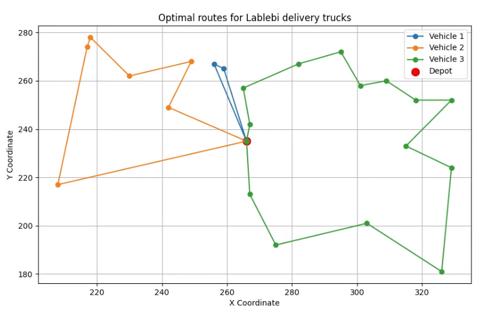

# Lalebi Trucks Delivery Optimization
In this project, we study the routing of delivery trucks for Lablebi, a popular and incredibly delicious Tunisian dish. Since Lablebi is best enjoyed hot, it is essential to optimize the routing for maximum efficiency. The routing task in this project is formulated as a Capacitated Vehicle Routing Problem (CVRP) and is expressed through the following mathematical model.

  

### Decision Variables

- $$x_{ij}^k \in {0, 1}$$: Binary variable:
  - $$x_{ij}^k = 1$$: Vehicle $$k$$ travels directly from node $$i$$ to node $$j$$.
  - $$x_{ij}^k = 0$$: Otherwise.
- $$u_i$$: Continuous variable representing the cumulative demand served upon reaching node $$i$$.

**Objective Function:**

$$
\min \sum_{k = 1}^{|K|} \sum_{i = 0}^{|N|} \sum_{j = 0}^{|N|} d_{ij} x_{ij}^k
$$

**Subject to**:

1. **Flow conservation**:

$$
\sum_{i = 0}^{|N|} x_{ij}^k = \sum_{i = 0}^{|N|} x_{ji}^k, \quad \forall j \in N, \enspace k \in K
$$

3. **Every node is visited exactly once**:

$$
\sum_{k = 1}^{|K|} \sum_{i = 0}^{|N|} x_{ij}^k = 1, \quad \forall j \in N \setminus {0}
$$

3. **Each vehicle departs from the depot once**:

$$
\sum_{j = 1}^{|N|} x_{0j}^k = 1, \quad \forall k \in K
$$

4. **Vehicle capacity constraint**:

$$
\sum_{i = 0}^{|N|} \sum_{j = 1}^{|N|} q_{j} x_{ij}^k \leq Q, \quad \forall k \in K
$$

5. **No self-loops**:

$$
x_{ii}^k = 0, \quad \forall k \in K, \enspace i \in N
$$

6. **Subtour elimination**:

$$
u_{j} - u_{i} \geq q_{j} - Q(1 - x_{ij}^k), \quad \forall i, j \in N \setminus {0}, \enspace i \neq j
$$

7. **Cumulative demand bounds**:

$$
q_{i} \leq u_{i} \leq Q, \quad \forall i \in N \setminus {0}
$$

8. **Binary decision variables**:

$$
x_{ij}^k \in {0, 1}, \quad \forall i, j \in N, \enspace k \in K
$$

---

### Explanation

* **Objective Function**: Minimize the total traveled distance by all vehicles.
* **Constraints**:
  - **Flow conservation** ensures that for each node, the number of incoming routes equals the number of outgoing routes for every vehicle.
  - **Unique visit** ensures that every node (except the depot) is visited exactly once by a single vehicle.
  - **Depot departure** guarantees that each vehicle starts its route from the depot.
  - **Capacity constraint** ensures that the total demand served by each vehicle does not exceed its capacity $$Q$$.
  - **No self-loops** prevents vehicles from traveling directly from a node to itself.
  - **Subtour elimination** avoids infeasible sub-routes using the cumulative demand variables $$u_i$$.
  - **Demand bounds** ensure that cumulative demand respects the node demands $$q_i$$ and vehicle capacity $$Q$$.
  - **Binary variables** specify whether an edge is traversed by a vehicle.
